---
## Front matter
title: "Отчёт по лабораторной работе № 3"
subtitle: "Дисциплина: Архитектура Компьютера"
author: "Ганина Таисия Сергеевна, НКАбд-01-22"

## Generic otions
lang: ru-RU
toc-title: "Содержание"

## Bibliography
bibliography: bib/cite.bib
csl: pandoc/csl/gost-r-7-0-5-2008-numeric.csl

## Pdf output format
toc: true # Table of contents
toc-depth: 2
lof: true # List of figures
fontsize: 12pt
linestretch: 1.5
papersize: a4
documentclass: scrreprt
## I18n polyglossia
polyglossia-lang:
  name: russian
  options:
	- spelling=modern
	- babelshorthands=true
polyglossia-otherlangs:
  name: english
## I18n babel
babel-lang: russian
babel-otherlangs: english
## Fonts
mainfont: PT Serif
romanfont: PT Serif
sansfont: PT Sans
monofont: PT Mono
mainfontoptions: Ligatures=TeX
romanfontoptions: Ligatures=TeX
sansfontoptions: Ligatures=TeX,Scale=MatchLowercase
monofontoptions: Scale=MatchLowercase,Scale=0.9
## Biblatex
biblatex: true
biblio-style: "gost-numeric"
biblatexoptions:
  - parentracker=true
  - backend=biber
  - hyperref=auto
  - language=auto
  - autolang=other*
  - citestyle=gost-numeric
## Pandoc-crossref LaTeX customization
figureTitle: ""
tableTitle: "Таблица"
listingTitle: "Листинг"
lofTitle: "Список иллюстраций"
lotTitle: "Список таблиц"
lolTitle: "Листинги"
## Misc options
indent: true
header-includes:
  - \usepackage{indentfirst}
  - \usepackage{float} # keep figures where there are in the text
  - \floatplacement{figure}{H} # keep figures where there are in the text
---

# Цель работы

Цель данной лабораторной работы — изучить идеологию и применение средств контроля
версий git, а также приобрести практические навыки по работе с этой системой.

# Задание

1. Зарегистрироваться в системе github.
2. Сделать базовую настройку git.
3. Создать SSH ключ.
4. Создать рабочее пространство и репозитория курса на основе шаблона.
5. Настройка каталога курса.
6. Проверила иерархию.
7. Создание отчёта в соответствующем каталоге рабочего пространства.
8. Скопировать отчёты предыдущих лабораторных.
9. Загрузить файлы на github.

# Теоретическое введение

Основные команды системы контроля версий Git (рис. [-@fig:1], [-@fig:2]):

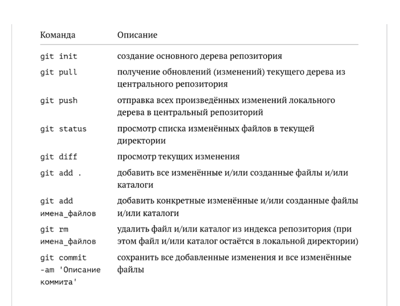{ #fig:1 width=70% }

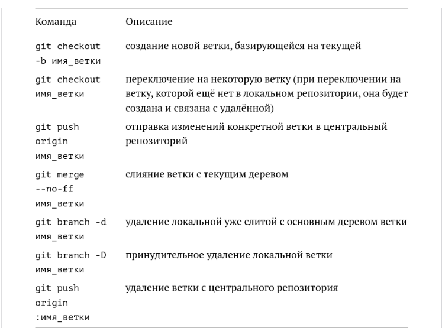{ #fig:2 width=70% }

# Выполнение лабораторной работы

1. Я зарегистрировалась в системе github. (рис. [-@fig:003], [-@fig:004])

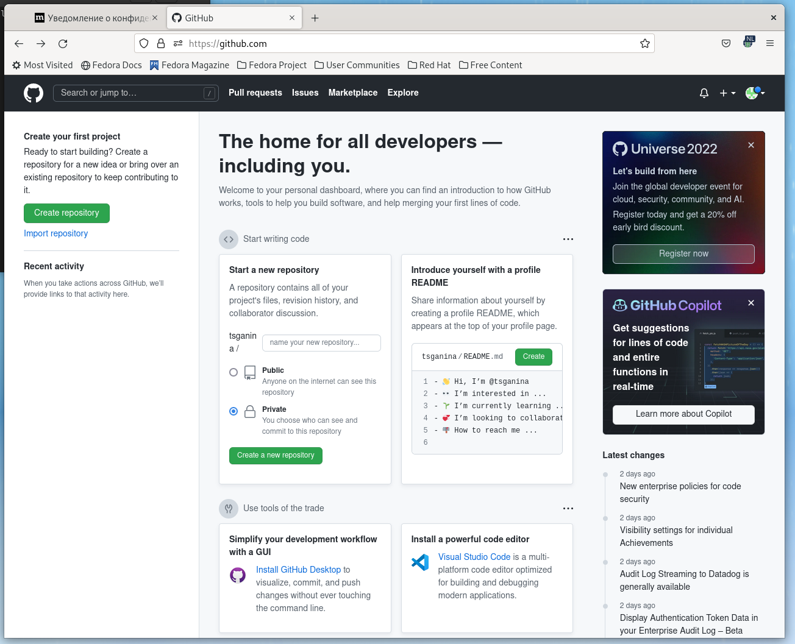{ #fig:003 width=70% }

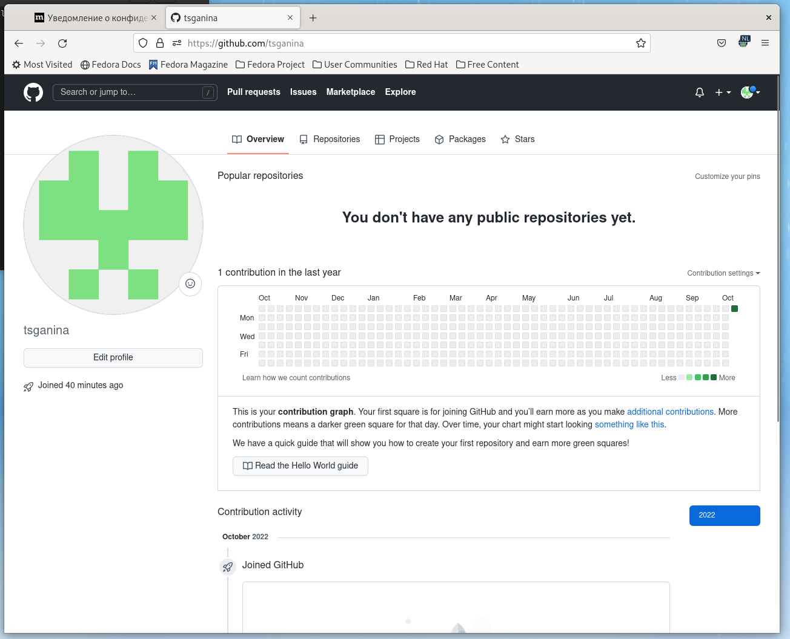{ #fig:004 width=70% }

2. Сделала базовую настройку git (рис. [-@fig:005], [-@fig:006]). 

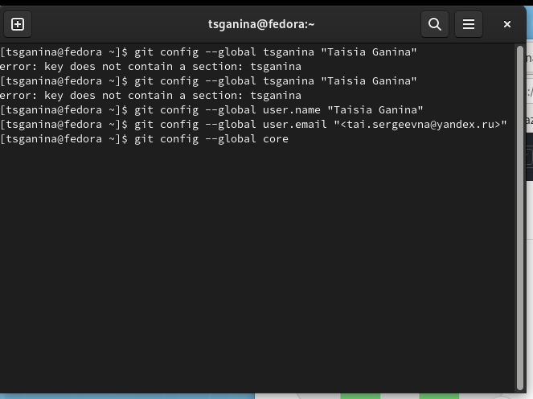{ #fig:005 width=70% }

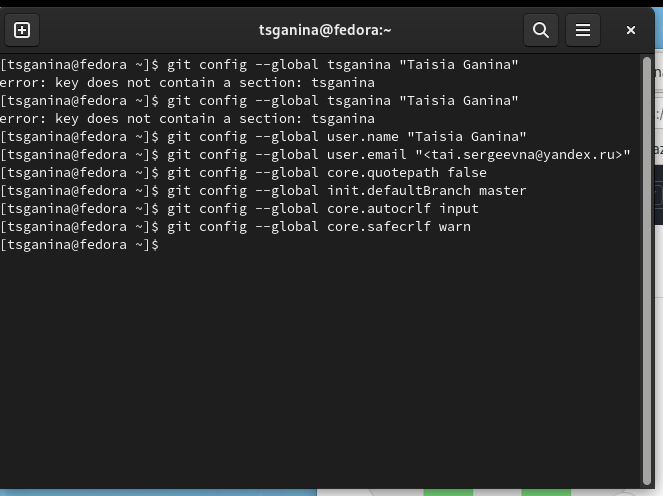{ #fig:006 width=70% }

3. Создала SSH ключ. Так как в программе отсутствовала команда xclip, установила
необходимые компоненты для её выполнения. (рис. [-@fig:007], [-@fig:008], [-@fig:009], [-@fig:010])

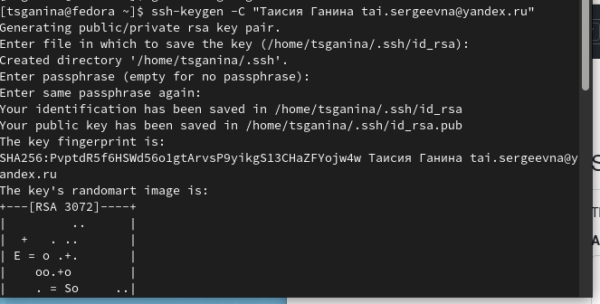{ #fig:007 width=70% }

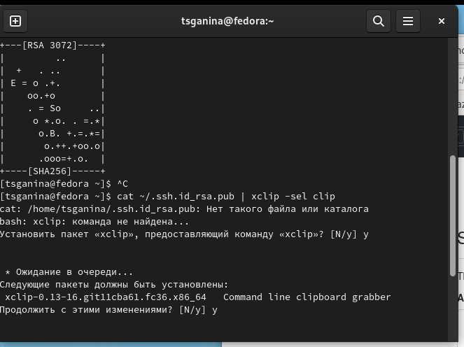{ #fig:008 width=70% }

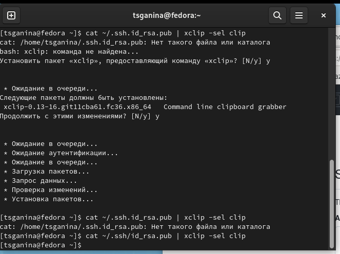{ #fig:009 width=70% }

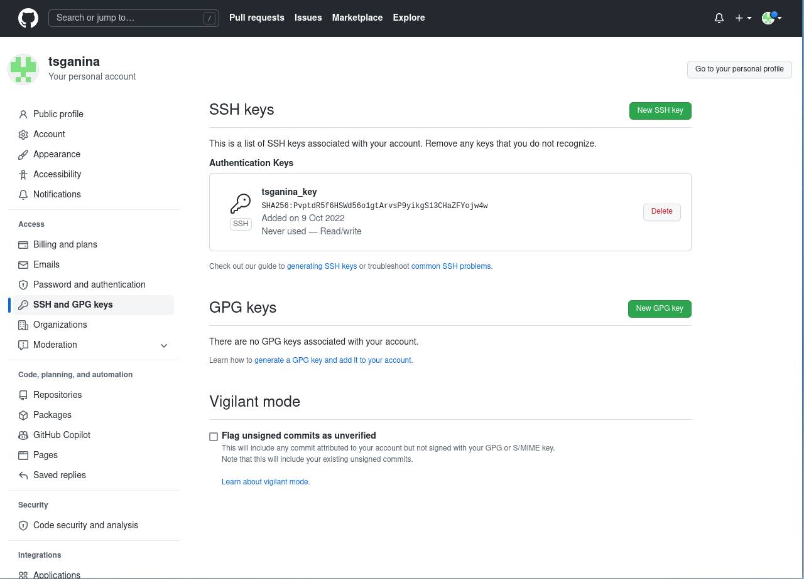{ #fig:010 width=70% }

4. Создала рабочее пространство и репозиторий курса на основе шаблона. 

	1. Используя такую команду как: mkdir -p ~/work/study/2022-2023/"Архитектура компьютера", сделала рабочий каталог. (рис. [-@fig:011])

	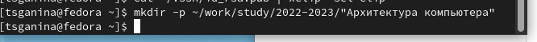{ #fig:011 width=70% }

	2. Создала репозиторий на основе шаблона. (рис. [-@fig:012], [-@fig:013])

	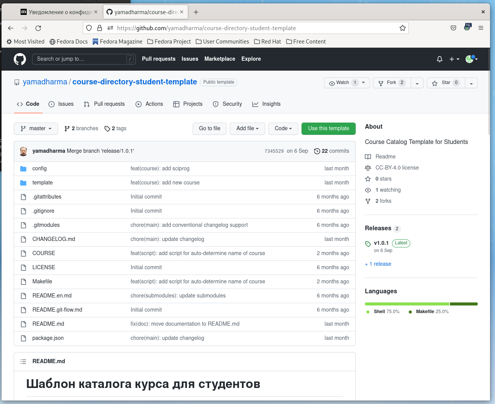{ #fig:012 width=70% }

	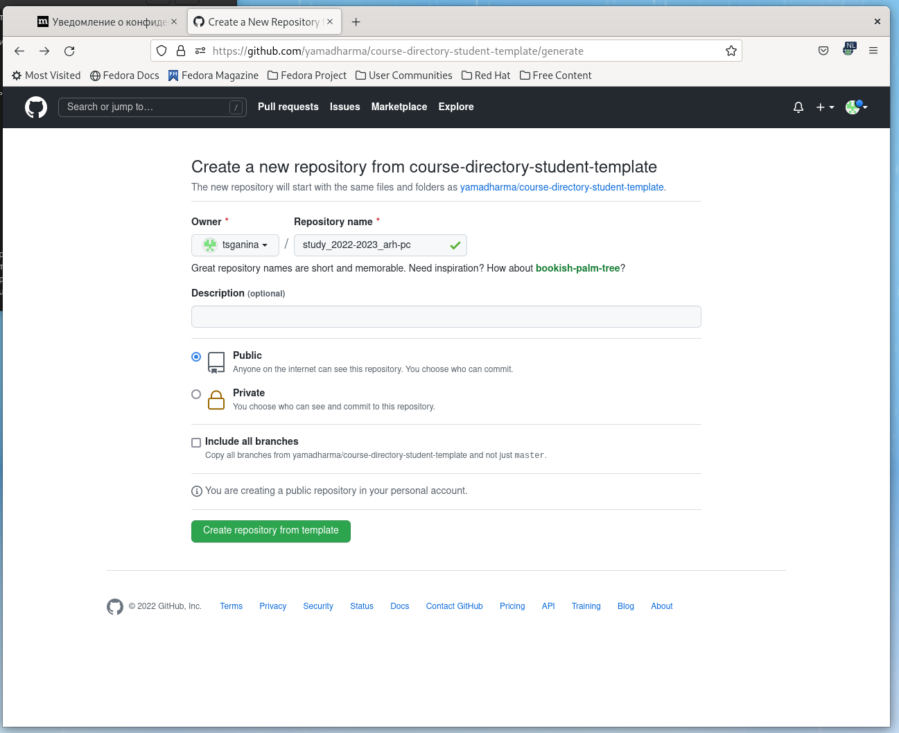{ #fig:013 width=70% }

	3. Открыла терминал и перешла в каталог курса. (рис. [-@fig:014])

	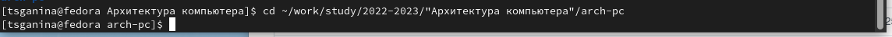{ #fig:014 width=70% }

	4. Клонировала созданный репозиторий. (рис. [-@fig:015])

	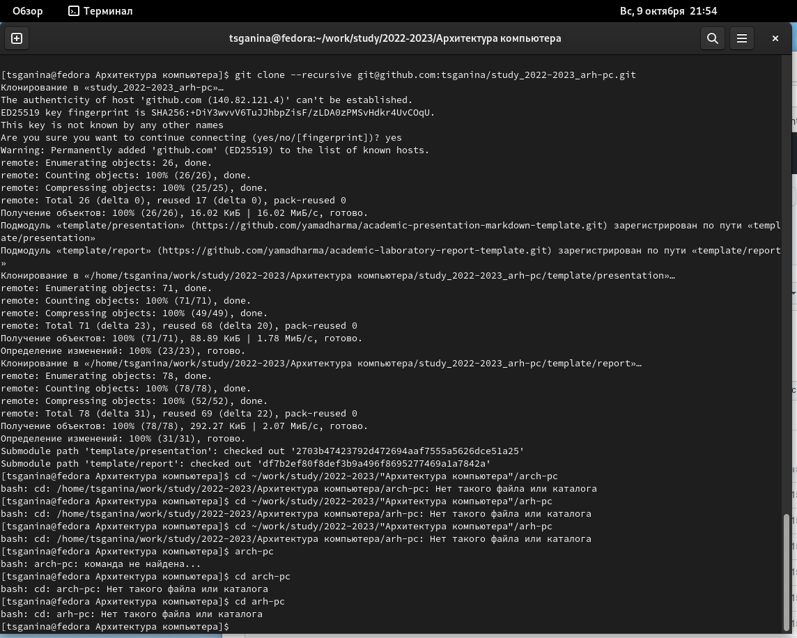{ #fig:015 width=70% }

5. Настроила созданный каталог.

	1. Перешла в каталог курса и удалила лишние файлы. (рис. [-@fig:016])

	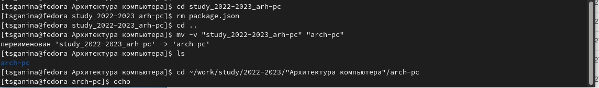{ #fig:016 width=70% }

	2. Создала необходимые каталоги и отправила файлы на сервер. (рис. [-@fig:017], [-@fig:018])

	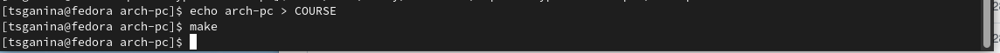{ #fig:017 width=70% }

	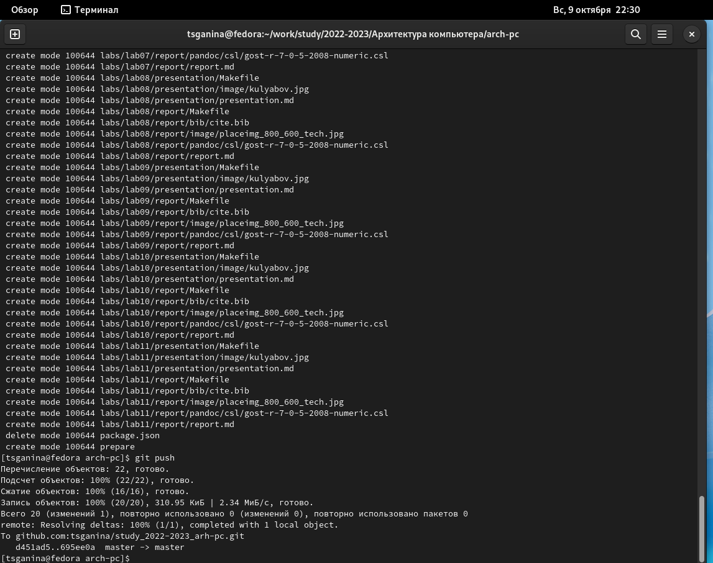{ #fig:018 width=70% }

6. Проверила иерархию.

	1. На github. (рис. [-@fig:019])

	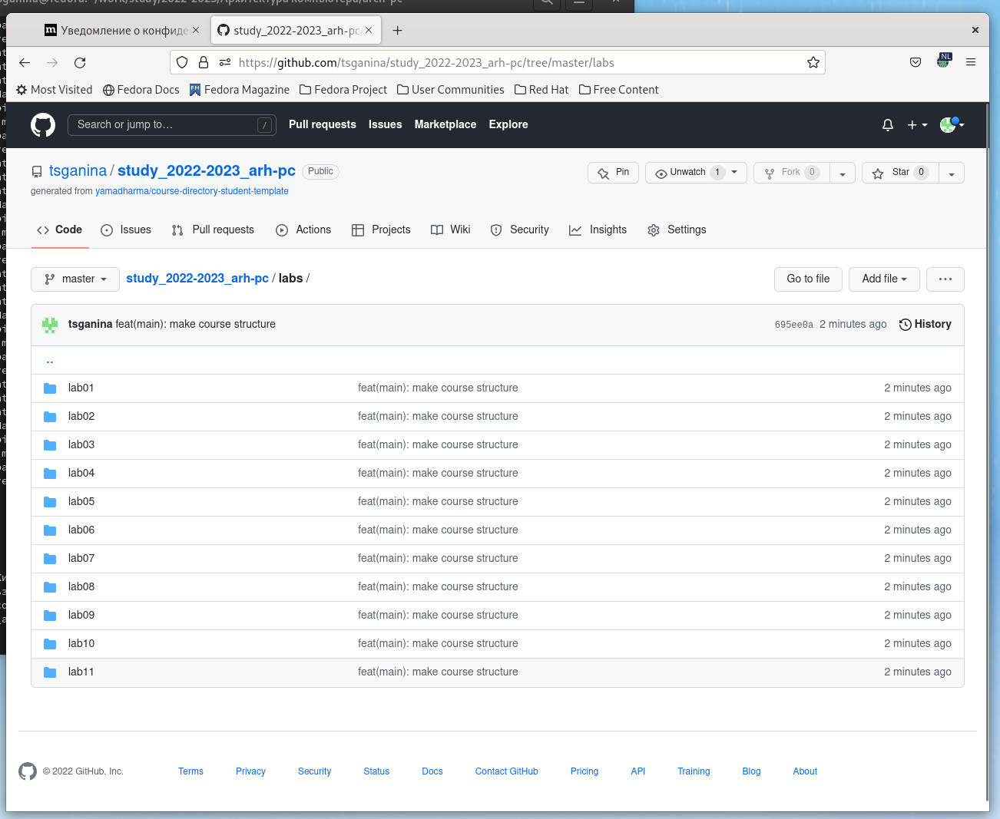{ #fig:019 width=70% }

	2. В своём рабочем пространстве. (рис. [-@fig:020])

	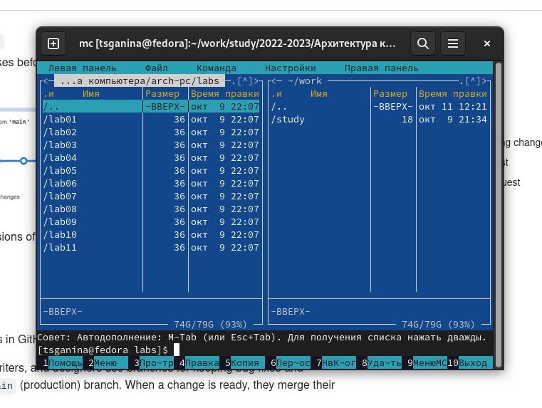{ #fig:020 width=70% }

7. Создала отчёт о выполнении третьей лабораторной работы в соответствующем каталоге рабочего пространства. (рис. [-@fig:021])

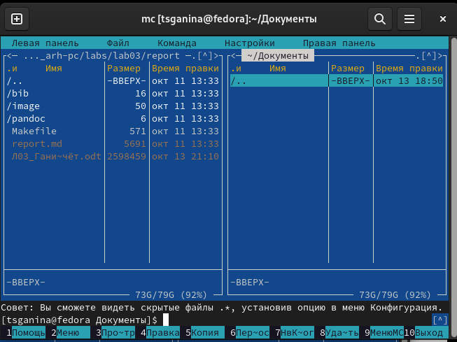{ #fig:021 width=70% }

8. Переместила все отчёты по лабораторным на github при помощи команд:

> git add .

> git commit -am „reports“

> git push

# Выводы

В ходе выполнения данной лабораторной работы я изучила идеологию и применение средств контроля версий git, а также приобрела практические навыки по работе с этой системой.

# Список литературы{.unnumbered}

[1. Текстовый файл «Лабораторная работа No3. Система контроля версий Git».](https://esystem.rudn.ru/pluginfile.php/1584625/mod_resource/content/1/%D0%9B%D0%B0%D0%B1%D0%BE%D1%80%D0%B0%D1%82%D0%BE%D1%80%D0%BD%D0%B0%D1%8F%20%D1%80%D0%B0%D0%B1%D0%BE%D1%82%D0%B0%20%E2%84%964.pdf)

::: {#refs}
:::
