---
## Front matter
title: "Отчёт по лабораторной работе № 4"
subtitle: "Дисциплина: Архитектура Компьютера"
author: "Ганина Таисия Сергеевна, НКАбд-01-22"

## Generic otions
lang: ru-RU
toc-title: "Содержание"

## Bibliography
bibliography: bib/cite.bib
csl: pandoc/csl/gost-r-7-0-5-2008-numeric.csl

## Pdf output format
toc: true # Table of contents
toc-depth: 2
lof: true # List of figures
lot: true # List of tables
fontsize: 12pt
linestretch: 1.5
papersize: a4
documentclass: scrreprt
## I18n polyglossia
polyglossia-lang:
  name: russian
  options:
	- spelling=modern
	- babelshorthands=true
polyglossia-otherlangs:
  name: english
## I18n babel
babel-lang: russian
babel-otherlangs: english
## Fonts
mainfont: PT Serif
romanfont: PT Serif
sansfont: PT Sans
monofont: PT Mono
mainfontoptions: Ligatures=TeX
romanfontoptions: Ligatures=TeX
sansfontoptions: Ligatures=TeX,Scale=MatchLowercase
monofontoptions: Scale=MatchLowercase,Scale=0.9
## Biblatex
biblatex: true
biblio-style: "gost-numeric"
biblatexoptions:
  - parentracker=true
  - backend=biber
  - hyperref=auto
  - language=auto
  - autolang=other*
  - citestyle=gost-numeric
## Pandoc-crossref LaTeX customization
figureTitle: ""
tableTitle: "Таблица"
listingTitle: "Листинг"
lofTitle: "Список иллюстраций"
lotTitle: "Список таблиц"
lolTitle: "Листинги"
## Misc options
indent: true
header-includes:
  - \usepackage{indentfirst}
  - \usepackage{float} # keep figures where there are in the text
  - \floatplacement{figure}{H} # keep figures where there are in the text
---

# Цель работы

Целью работы является освоение процедуры оформления отчетов с помощью легковесного языка разметки Markdown.

# Задание

1. Скачать и установить texlive.
2. Скачать и установить pandoc, pandoc-crossref.
3. Провести компиляцию шаблона с использованием Makefile.
4. Удалила полученный файлы с использованием Makefile.
5. Сделать отчёт по третьей лабораторной в формате markdown.
6. Загрузила файлы на github.

# Теоретическое введение

Например, в табл. [-@tbl:std-dir] приведено краткое описание стандартных команд markdown.

: Kраткое описание стандартных команд markdown {#tbl:std-dir}

**Команда** | **Что выполняет**
------------|------------------
`#Заголовок 1`|#Заголовок 1
`## Заголовок 3` |## Заголовок 2
`### Заголовок 3` |### Заголовок 3 
`#### Заголовок 4` |#### Заголовок 4 
`*Текст курсивом*`|*Текст курсивом*
`**Жирный текст** `|**Жирный текст** 
`~~Зачеркнутый текст~~ `|~~Зачеркнутый текст~~ 
`code` | 
`[Текст ссылки](URL_ссылки)`|[ТУИС](https://esystem.rudn.ru/) 

# Выполнение лабораторной работы

1. Скачала и установила texlive. (рис. [-@fig:001], [-@fig:002], [-@fig:003], [-@fig:004], [-@fig:005])

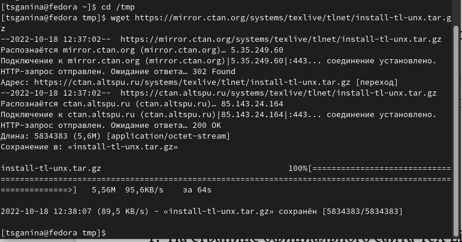{ #fig:001 width=70% }

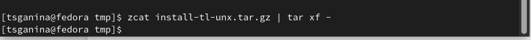{ #fig:002 width=70% }

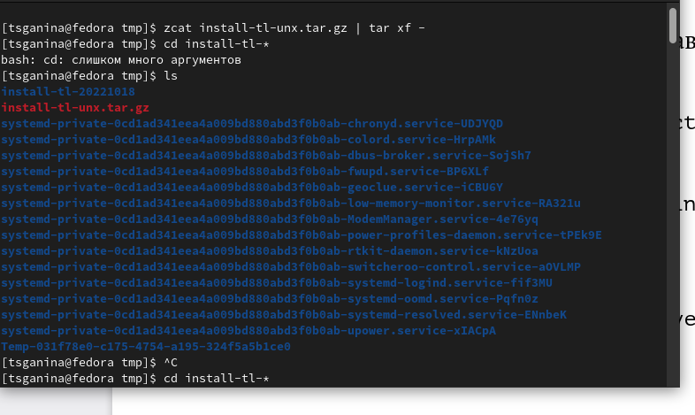{ #fig:003 width=70% }

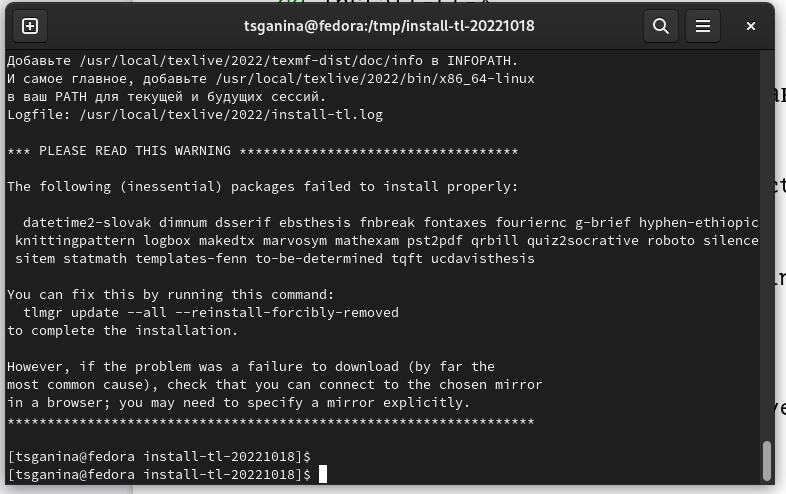{ #fig:004 width=70% }

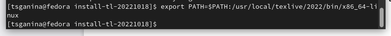{ #fig:005 width=70% }

2. Скачала и установила pandoc, pandoc-crossref. (рис. [-@fig:006], [-@fig:007], [-@fig:008], [-@fig:009]). 

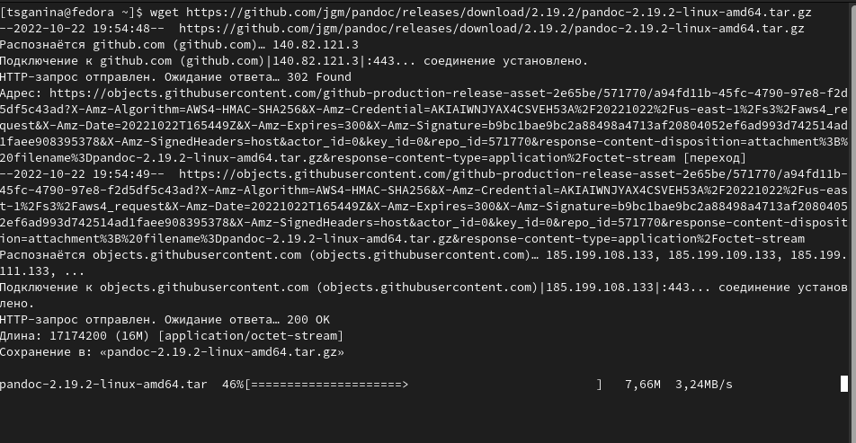{ #fig:006 width=70% }

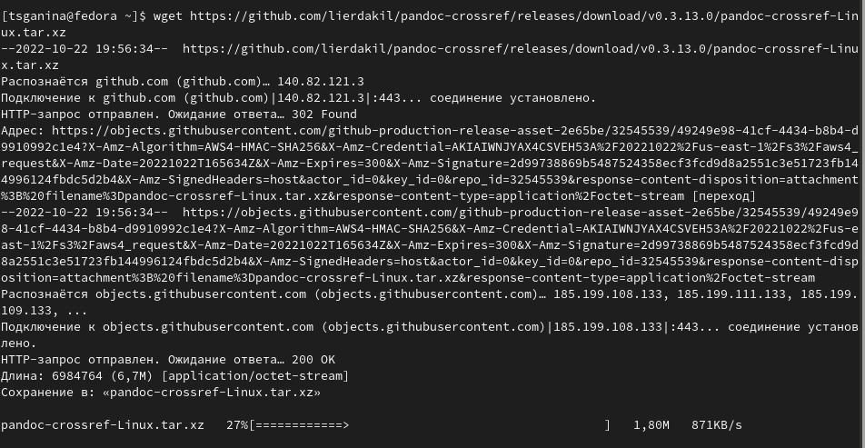{ #fig:007 width=70% }

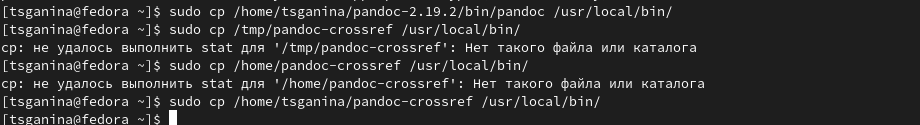{ #fig:008 width=70% }

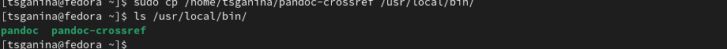{ #fig:009 width=70% }

3. Провести компиляцию шаблона с использованием Makefile. (рис. [-@fig:010], [-@fig:011])

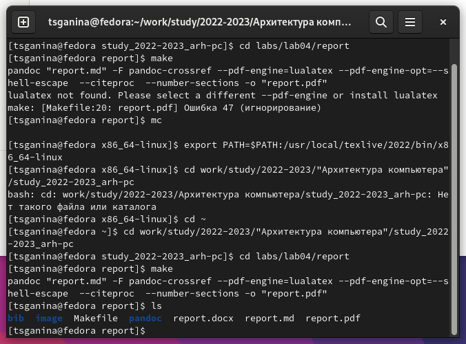{ #fig:010 width=70% }

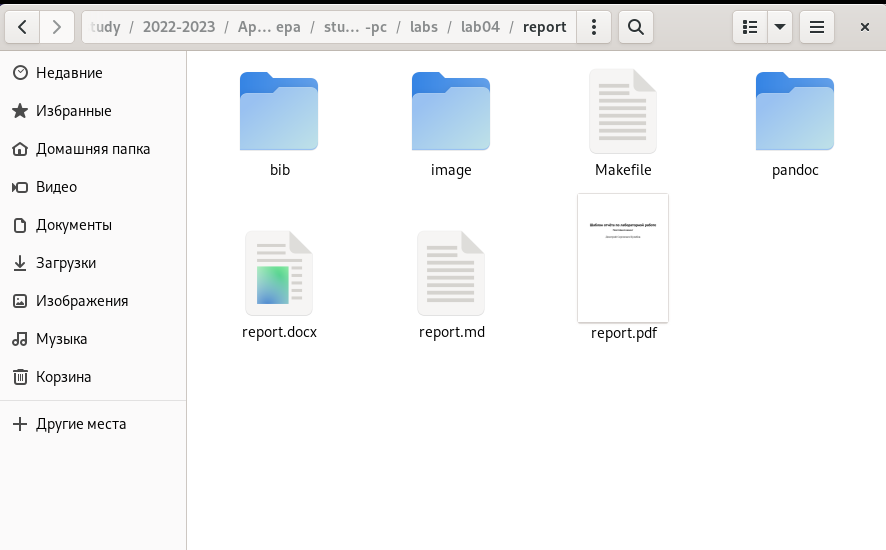{ #fig:011 width=70% }

4. Удалила полученный файлы с использованием Makefile. (рис. [-@fig:012], [-@fig:013])

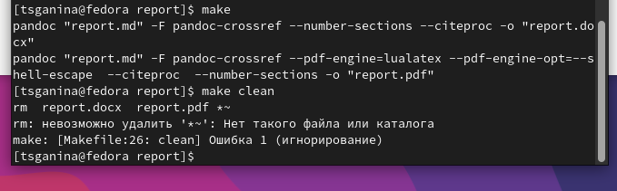{ #fig:012 width=70% }

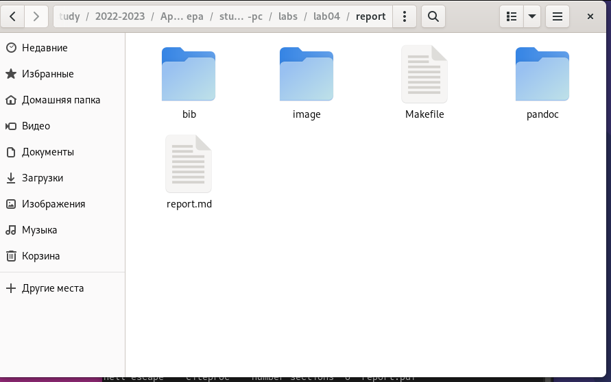{ #fig:013 width=70% }

5. Сделала отчёт по третьей лабораторной в формате markdown. (рис. [-@fig:014], [-@fig:015])

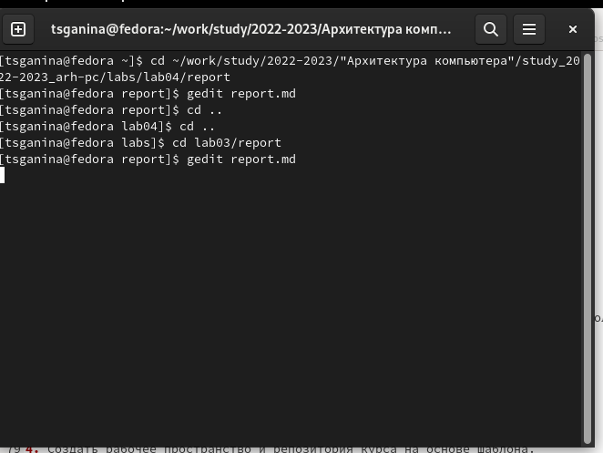{ #fig:014 width=70% }

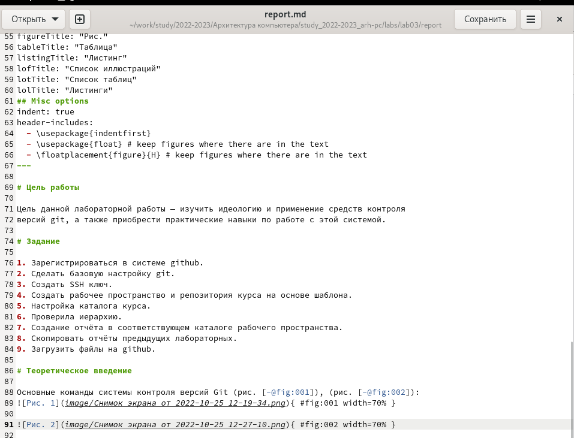{ #fig:015 width=70% }

6. Загрузила файлы на github. (рис. [-@fig:016])

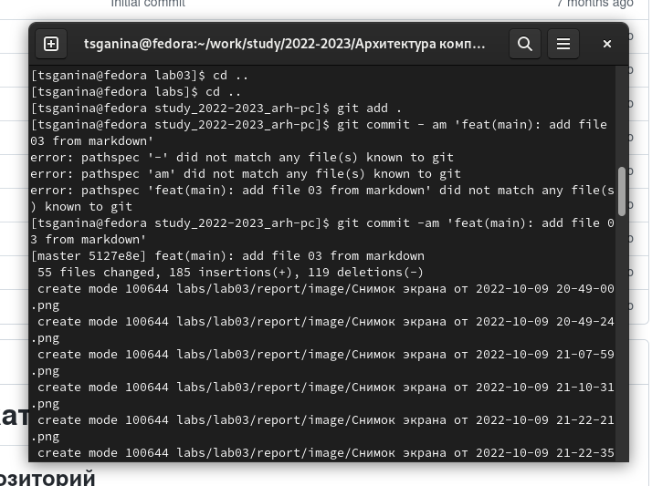{ #fig:016 width=70% }

> git add .

> git commit -am ""

> git push

# Выводы

В ходе данной работы я освоила процедуры оформления отчетов с помощью легковесного языка разметки Markdown.

# Список литературы{.unnumbered}

[1. Текстовый файл «Лабораторная работа №4. Язык разметки Markdown](https://esystem.rudn.ru/pluginfile.php/1584625/mod_resource/content/1/%D0%9B%D0%B0%D0%B1%D0%BE%D1%80%D0%B0%D1%82%D0%BE%D1%80%D0%BD%D0%B0%D1%8F%20%D1%80%D0%B0%D0%B1%D0%BE%D1%82%D0%B0%20%E2%84%964.pdf)

::: {#refs}
:::
