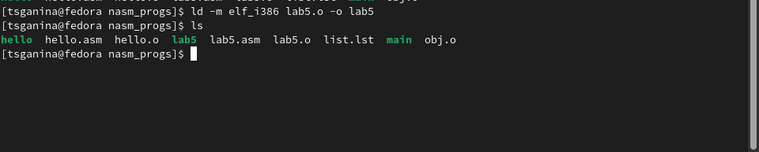

---
## Front matter
title: "Отчёт по лабораторной работе №5"
subtitle: "Дисциплина: архитектура компьютера"
author: "Ганина Таисия Сергеевна, НКАбд-01-22"

## Generic otions
lang: ru-RU
toc-title: "Содержание"

## Bibliography
bibliography: bib/cite.bib
csl: pandoc/csl/gost-r-7-0-5-2008-numeric.csl

## Pdf output format
toc: true # Table of contents
toc-depth: 2
lof: true # List of figures
fontsize: 12pt
linestretch: 1.5
papersize: a4
documentclass: scrreprt
## I18n polyglossia
polyglossia-lang:
  name: russian
  options:
	- spelling=modern
	- babelshorthands=true
polyglossia-otherlangs:
  name: english
## I18n babel
babel-lang: russian
babel-otherlangs: english
## Fonts
mainfont: PT Serif
romanfont: PT Serif
sansfont: PT Sans
monofont: PT Mono
mainfontoptions: Ligatures=TeX
romanfontoptions: Ligatures=TeX
sansfontoptions: Ligatures=TeX,Scale=MatchLowercase
monofontoptions: Scale=MatchLowercase,Scale=0.9
## Biblatex
biblatex: true
biblio-style: "gost-numeric"
biblatexoptions:
  - parentracker=true
  - backend=biber
  - hyperref=auto
  - language=auto
  - autolang=other*
  - citestyle=gost-numeric
## Pandoc-crossref LaTeX customization
figureTitle: ""
tableTitle: "Таблица"
listingTitle: "Листинг"
lofTitle: "Список иллюстраций"
lotTitle: "Список таблиц"
lolTitle: "Листинги"
## Misc options
indent: true
header-includes:
  - \usepackage{indentfirst}
  - \usepackage{float} # keep figures where there are in the text
  - \floatplacement{figure}{H} # keep figures where there are in the text
---

# Цель работы

Освоение процедуры компиляции и сборки программ, написанных на ассемблере NASM.

# Задание

1. Создать каталог для работы с программами на языке ассемблера NASM.
2. Перейти в созданный каталог и создать текстовый файл с именем hello.asm
3. Открыть файл с помощью текстового редактора.
4. Внести в файл кода изменения и превратить его в объектный файл.
5. Скомпилировать исходный файл в obj.o, проверить, что всё выполнено. (есть obj.o, list.lst)
6. Скомпоновать файл, создать файл main.o, выяснить какое имя будет иметь исполняемый файл объектный, из которого он собран.
7. Запустить файл hello.
8. Создать копию файла hello с именем lab5.
9. Изменить текст так, чтобы выводилась строка с именем и фамилией.
10. Выполнить компоновку объектного файла и запустить получившийся исполняемый файл.

# Теоретическое введение

Структурная схема ЭВМ (рис. [-@fig:001]).

{ #fig:001 width=70% }

Основной задачей процессора является обработка информации, а также организация координации всех узлов компьютера. В состав центрального процессора (ЦП) входят следующие устройства:

• арифметико-логическое устройство (АЛУ) — выполняет логические и арифметические действия, необходимые для обработки информации, хранящейся в памяти;

• устройство управления (УУ) — обеспечивает управление и контроль всех устройств компьютера;

• регистры — сверхбыстрая оперативная память небольшого объёма, входящая в состав процессора, для временного хранения промежуточных результатов выполнения инструкций; 

Регистры процессора делятся на два типа: регистры общего назначения и специальные регистры. Для того, чтобы писать программы на ассемблере, необходимо знать, какие регистры процессора существуют и как их можно использовать. Большинство команд в программах написанных на ассемблере используют регистры в качестве операндов. Практически все команды представляют собой преобразование данных хранящихся в регистрах процессора, это например пересылка данных между регистрами или между регистрами и памятью, преобразование (арифметические или логические операции) данных хранящихся в регистрах. Доступ к регистрам осуществляется не по адресам, как к основной памяти, а по именам. Каждый регистр процессора архитектуры x86 имеет свое название, состоящее из 2 или 3 букв латинского алфавита.

В качестве примера приведем названия основных регистров общего назначения именно эти регистры чаще всего используются при написании программ):

• RAX, RCX, RDX, RBX, RSI, RDI — 64-битные

• EAX, ECX, EDX, EBX, ESI, EDI — 32-битные

• AX, CX, DX, BX, SI, DI — 16-битные

• AH, AL, CH, CL, DH, DL, BH, BL — 8-битные (половинки 16-битных регистров). Например, AH (high AX) — старшие 8 бит регистра AX, AL (low AX) — младшие 8 бит регистра AX

# Выполнение лабораторной работы

1. Создала каталог для работы с программами на языке ассемблера NASM (рис. [-@fig:002]).

{ #fig:002 width=70% }

2. Перешла в созданный каталог и создала текстовый файл с именем hello.asm (рис. [-@fig:003]).

{ #fig:003 width=70% }

3. Открыла файл с помощью текстового редактора (рис. [-@fig:004]).

{ #fig:004 width=70% }

4. Внесла в файл кода изменения и превратила его в объектный файл (рис. [-@fig:005]).

{ #fig:005 width=70% }

5. Скомпилировала исходный файл в obj.o, проверила, что всё выполнено. (есть obj.o, list.lst) (рис. [-@fig:006]).

{ #fig:006 width=70% }

6. Скомпоновала файл, создала файл main, выяснила какое имя будет иметь исполняемый файл и объектный, из которого он собран (рис. [-@fig:007], [-@fig:008]).

{ #fig:007 width=70% }

{ #fig:008 width=70% }

У объектного файла имя obj.o, а у исполняемого файла - main.

7. Запустила файл hello (рис. [-@fig:009]).

{ #fig:009 width=70% }

8. Создала копию файла hello с именем lab5 (рис. [-@fig:010]).

{ #fig:010 width=70% }

9. Изменила текст так, чтобы выводилась строка с именем и фамилией (рис. [-@fig:011]).

{ #fig:011 width=70% }

10. Выполнила компоновку объектного файла и запустить получившийся исполняемый файл (рис. [-@fig:012], [-@fig:013], [-@fig:014]).

{ #fig:012 width=70% }

{ #fig:013 width=70% }

{ #fig:014 width=70% }

# Выводы

В ходе данной лабораторной работы я освоила процедуры компиляции и сборки программ, написанных на ассемблере NASM.

# Список литературы{.unnumbered}

::: {#refs}
:::
