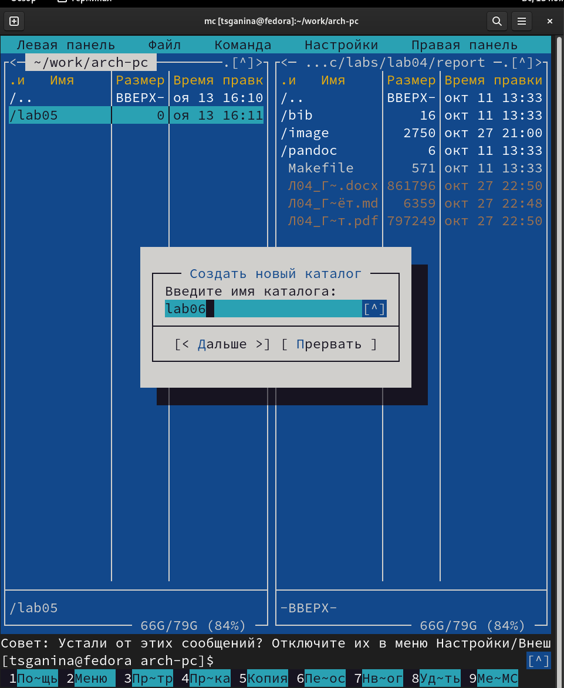
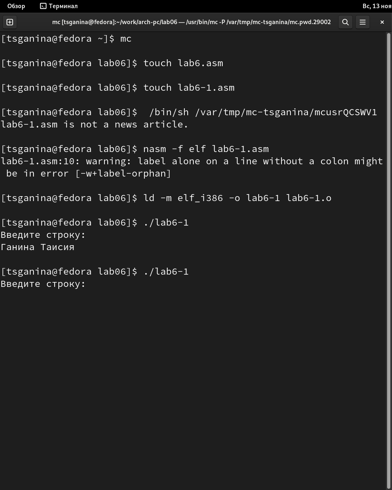

---
## Front matter
title: "Отчёт по лабораторной работе №6"
subtitle: "Дисциплина: Архитектура компьютера"
author: "Ганина Таисия Сергеевна"

## Generic otions
lang: ru-RU
toc-title: "Содержание"

## Bibliography
bibliography: bib/cite.bib
csl: pandoc/csl/gost-r-7-0-5-2008-numeric.csl

## Pdf output format
toc: true # Table of contents
toc-depth: 2
lof: true # List of figures
lot: true # List of tables
fontsize: 12pt
linestretch: 1.5
papersize: a4
documentclass: scrreprt
## I18n polyglossia
polyglossia-lang:
  name: russian
  options:
	- spelling=modern
	- babelshorthands=true
polyglossia-otherlangs:
  name: english
## I18n babel
babel-lang: russian
babel-otherlangs: english
## Fonts
mainfont: PT Serif
romanfont: PT Serif
sansfont: PT Sans
monofont: PT Mono
mainfontoptions: Ligatures=TeX
romanfontoptions: Ligatures=TeX
sansfontoptions: Ligatures=TeX,Scale=MatchLowercase
monofontoptions: Scale=MatchLowercase,Scale=0.9
## Biblatex
biblatex: true
biblio-style: "gost-numeric"
biblatexoptions:
  - parentracker=true
  - backend=biber
  - hyperref=auto
  - language=auto
  - autolang=other*
  - citestyle=gost-numeric
## Pandoc-crossref LaTeX customization
figureTitle: ""
tableTitle: "Таблица"
listingTitle: "Листинг"
lofTitle: "Список иллюстраций"
lotTitle: "Список таблиц"
lolTitle: "Листинги"
## Misc options
indent: true
header-includes:
  - \usepackage{indentfirst}
  - \usepackage{float} # keep figures where there are in the text
  - \floatplacement{figure}{H} # keep figures where there are in the text
---

# Цель работы

Приобретение практических навыков работы в Midnight Commander. Освоение
инструкций языка ассемблера mov и int.

# Задание

1. Открыть Midnight Commander, перейти в каталог ~/work/arch-pc.
2. Создать папку lab06, перейти в неё.
3. Создать файл lab6-1.asm, открыть его, ввести текст из листинга 6.1.
4. Оттранслировать программу lab6-1.asm в объектный файл, запустить исполняемый файл.
5. Создать копию файла lab6-1.asm с названием lab6-2.asm, заполнить согласно листингу 6.2.
6. Создать исполняемый файл, проверить его работу.
7. Заменить подпрограмму sprintLF на sprint, проверить, в чем разница.
8. Внести изменения в копию программы lab6-1.asm так, чтобы она выводила приглашение "Введите строку" и после выводила заполненный с клавиатуры ответ. Проверить работу исполняемого файла. 
9. Внести изменения в копию программы lab6-2.asm так, чтобы она выводила приглашение "Введите строку" и после выводила заполненный с клавиатуры ответ. Проверить работу исполняемого файла.

# Теоретическое введение

Midnight Commander (или просто mc) — это программа, которая позволяет просматривать структуру каталогов и выполнять основные операции по управлению файловой системой, т.е. mc является файловым менеджером. Midnight Commander позволяет сделать работу с файлами более удобной и наглядной.

Например, в табл. [-@tbl:std-dir] приведено краткое описание использования функциональных клавиш.

: Функциональные клавиши Midnight Commander {#tbl:std-dir}

**Функциональные клавиши** | **Выполняемое действие**
---------------------------|---------------------------
`F1`| вызов контекстно-зависимой подсказки
`F2`| вызов меню, созданного пользователем
`F3`| просмотр файла, на который указывает подсветка в активной панели
`F4`| вызов встроенного редактора для файла, на который указывает подсветка в активной панели
`F5`| копирование файла или группы отмеченных файлов из каталога, отображаемого в активной панели, в каталог, отображаемый на второй панели
`F6`| перенос файла или группы отмеченных файлов из каталога, отображаемого в активной панели, в каталог, отображаемый на второй панели
`F7`| создание подкаталога в каталоге, отображаемом в активной панели
`F8`| удаление файла (подкаталога) или группы отмеченных файлов
`F9`| вызов основного меню программы
`F10`| выход из программы

# Выполнение лабораторной работы

1. Открыла Midnight Commander, перешла в каталог ~/work/arch-pc. (рис. [-@fig:001], [-@fig:002])

{ #fig:001 width=70% }

{ #fig:002 width=70% }

2. Создала папку lab06, перешла в неё. (рис. [-@fig:003])

{ #fig:003 width=70% }

3. Создала файл lab6-1.asm, открыла его, ввела текст из листинга 6.1. (рис. [-@fig:004],[-@fig:005],[-@fig:006])

{ #fig:004 width=70% }

{ #fig:005 width=70% }

{ #fig:006 width=70% }

4. Оттранслировала программу lab6-1.asm в объектный файл, запустила исполняемый файл. (рис. [-@fig:007],[-@fig:008],[-@fig:009])

{ #fig:007 width=70% }

{ #fig:008 width=70% }

{ #fig:009 width=70% }

5. Создать копию файла lab6-1.asm с названием lab6-2.asm, заполнить согласно листингу 6.2. (рис. [-@fig:010],[-@fig:011])

{ #fig:010 width=70% }

{ #fig:011 width=70% }

6. Создать исполняемый файл, проверить его работу. (рис. [-@fig:012])

{ #fig:012 width=70% }

7. Заменить подпрограмму sprintLF на sprint, проверить, в чем разница. (рис. [-@fig:013])

{ #fig:013 width=70% }

Вывод: разница в том, что после замены команды поле ввода перестало перемещаться на следующую строку.

8. Внести изменения в копию программы lab6-1.asm так, чтобы она выводила приглашение "Введите строку" и после выводила заполненный с клавиатуры ответ. Проверить работу исполняемого файла. (рис. [-@fig:014], [-@fig:015])

{ #fig:014 width=70% }

{ #fig:015 width=70% }

9. Внести изменения в копию программы lab6-2.asm так, чтобы она выводила приглашение "Введите строку" и после выводила заполненный с клавиатуры ответ. Проверить работу исполняемого файла. (рис. [-@fig:016], [-@fig:017])

{ #fig:016 width=70% }

{ #fig:017 width=70% }

# Списки программ:

1. __lab6-1.asm__ - без использования файла in_out

`SECTION .data`

`msg: DB 'Введите строку:',10`

`msgLen: EQU $-msg`

`SECTION .bss`

`buf1: RESB 80`

`SECTION .text`

`GLOBAL _start`

` _start:`

 
` mov eax,4`

` mov ebx,1`

` mov ecx,msg`

` mov edx,msgLen`

` int 80h`
 
 
 
` mov eax, 3`

` mov ebx, 0`

` mov ecx, buf1`

` mov edx, 80`

` int 80h`

 
` mov eax,1`

` mov ebx,0`

` int 80h`

2. __lab6-2.asm__ - с использованием файла in_out, с LF

`%include 'in_out.asm'`

`SECTION .data`

`msg: DB 'Введите строку:',0h`

`SECTION .bss`

`buf1: RESB 80`

`SECTION .text`

`    GLOBAL _start`

`    _start:`

    
`    mov eax, msg`

`    call sprintLF`
    
    
    
`    mov ecx, buf1`

`    mov edx, 80`

`    call sread`

    
`    call quit`

3. __lab6-2-1.asm__ - с использованием файла in_out, без LF

`%include 'in_out.asm'`

`SECTION .data`

`msg: DB 'Введите строку:',0h`

`SECTION .bss`

`buf1: RESB 80`

`SECTION .text`

`    GLOBAL _start`

`    _start:`

`    mov eax, msg`

`    call sprint`

`    mov ecx, buf1`

`    mov edx, 80`

`    call sread`

`    call quit`

4. __lab6_1_sr.asm__ - без использования файла in_out, вывод строки, введенной с клавиатуры

`SECTION .data`

`msg: DB 'Введите строку:',10`

`msgLen: EQU $-msg`

`SECTION .bss`

`buf1: RESB 80`

`SECTION .text`

`GLOBAL _start`

` _start:`

` mov eax,4`

` mov ebx,1`

` mov ecx,msg`

` mov edx,msgLen`

` int 80h`

` mov eax, 3`

` mov ebx, 0`

` mov ecx, buf1`

` mov edx, 80`

` int 80h`

` mov eax,4`

` mov ebx,1`

` mov ecx,buf1`

` mov edx,buf1`

` int 80h`

` mov eax,1`

` mov ebx,0`

` int 80h`

 5. __lab6_2_sr.asm__ - с использованием файла in_out, вывод строки, введенной с клавиатуры
 
` %include 'in_out.asm'`

`SECTION .data`

`msg: DB 'Введите строку:',0h`

`SECTION .bss`

`buf1: RESB 80`

`SECTION .text`

`    GLOBAL _start`

`    _start:`

`    mov eax, msg`

`    call sprint`

`    mov ecx, buf1`

`    mov edx, 80`

`    call sread`

`    mov eax, buf1`

`    call sprint`

`    call quit`
 
# Выводы

Я приобрела практические навыки работы в Midnight Commander и освоила
инструкции языка ассемблера mov и int.

# Список литературы{.unnumbered}

[1. Текстовый файл «Лабораторная работа №6. Основы работы с Midnight Commander (mc). Структура программы на языке ассемблера NASM. Системные вызовы в ОС GNU Linux](https://esystem.rudn.ru/pluginfile.php/1584633/mod_resource/content/1/%D0%9B%D0%B0%D0%B1%D0%BE%D1%80%D0%B0%D1%82%D0%BE%D1%80%D0%BD%D0%B0%D1%8F%20%D1%80%D0%B0%D0%B1%D0%BE%D1%82%D0%B0%20%E2%84%966.pdf)

::: {#refs}
:::
