---
## Front matter
title: "Отчёт по лабораторной работе №7"
subtitle: "Дисциплина: Архитектура компьютера"
author: "Ганина Таисия, НКАбд-01-22"

## Generic otions
lang: ru-RU
toc-title: "Содержание"

## Bibliography
bibliography: bib/cite.bib
csl: pandoc/csl/gost-r-7-0-5-2008-numeric.csl

## Pdf output format
toc: true # Table of contents
toc-depth: 2
lof: true # List of figures
lot: true # List of tables
fontsize: 12pt
linestretch: 1.5
papersize: a4
documentclass: scrreprt
## I18n polyglossia
polyglossia-lang:
  name: russian
  options:
	- spelling=modern
	- babelshorthands=true
polyglossia-otherlangs:
  name: english
## I18n babel
babel-lang: russian
babel-otherlangs: english
## Fonts
mainfont: PT Serif
romanfont: PT Serif
sansfont: PT Sans
monofont: PT Mono
mainfontoptions: Ligatures=TeX
romanfontoptions: Ligatures=TeX
sansfontoptions: Ligatures=TeX,Scale=MatchLowercase
monofontoptions: Scale=MatchLowercase,Scale=0.9
## Biblatex
biblatex: true
biblio-style: "gost-numeric"
biblatexoptions:
  - parentracker=true
  - backend=biber
  - hyperref=auto
  - language=auto
  - autolang=other*
  - citestyle=gost-numeric
## Pandoc-crossref LaTeX customization
figureTitle: ""
tableTitle: "Таблица"
listingTitle: "Листинг"
lofTitle: "Список иллюстраций"
lotTitle: "Список таблиц"
lolTitle: "Листинги"
## Misc options
indent: true
header-includes:
  - \usepackage{indentfirst}
  - \usepackage{float} # keep figures where there are in the text
  - \floatplacement{figure}{H} # keep figures where there are in the text
---

# Цель работы

Освоение арифметических инструкций языка ассемблера NASM.

# Задание

1. Создать файл lab7-1.asm и ввести в него программу из листинга 1, создать исполняемый файл и запустить его.
2. Исправить листинг 1, заменив строки 

`mov eax,'6'` 

`mov ebx,'4'`

на строки 

`mov eax,6`

`mov ebx,4`

Создать исполняемый файл и запустить его, пользуясь таблицей ASCII
определить какому символу соответствует код 10.

3. Создать файл lab7-2.аsm, ввести в него программу из листинга 2, создать исполняемый файл и запустить его. 
4. Исправить листинг 2, заменив строки 

`mov eax,'6'` 

`mov ebx,'4'`

на строки 

`mov eax,6`

`mov ebx,4`

Создать исполняемый файл и запустить его.

5. Заменить функцию iprintLF на iprint. Создать исполняемый файл и запустить его. Выяснить чем отличается вывод функций iprintLF и iprint.
6. Создать файл lab7-3.asm, заполнить его соответственно с листингом 3, создать исполняемый файл и запустить его.
7. Изменить файл так, чтобы программа вычисляла выражение $f(𝑥) = (4 ∗ 6 + 2)/5$
8. Создать файл "вариант", заполнить его соответственно с листингом 4, создать исполняемый файл и запустить его.
9. Ответить на вопросы по разделу.
10. Написать программу для вычисления выражения $5*(𝑥 + 18) − 28$ и проверить его при х=2 и при х=3.

# Теоретическое введение

Схема команды целочисленного сложения add *(от англ. addition - добавление)* выполняет сложение двух операндов и записывает результат по адресу первого операнда. 

1. Команда add работает как с числами со знаком, так и без знака и выглядит следующим образом:

`add <операнд_1>, <операнд_2>`

Допустимые сочетания операндов для команды add аналогичны сочетаниям
операндов для команды mov. Так, например, команда add eax,ebx прибавит значение из регистра eax к
значению из регистра ebx и запишет результат в регистр eax.

2. Команда целочисленного вычитания sub *(от англ. subtraction – вычитание)* работает аналогично команде add и выглядит следующим образом:

`sub <операнд_1>, <операнд_2>`

Так, например, команда sub ebx,5 уменьшает значение регистра ebx на 5 и записывает результат в регистр ebx.

3. Довольно часто при написании программ встречается операция прибавления или вычитания единицы. Прибавление единицы называется инкрементом, а вычитание — декрементом. Для этих операций существуют специальные команды: inc *(от англ. increment)* и dec *(от англ. decrement)*, которые увеличивают и уменьшают на 1 свой операнд.
Эти команды содержат один операнд и имеет следующий вид:

`inc <операнд>`

`dec <операнд>`

Операндом может быть регистр или ячейка памяти любого размера. Команды инкремента и декремента выгодны тем, что они занимают меньше места, чем соответствующие команды сложения и вычитания. Так, например, команда `inc ebx` увеличивает значение регистра ebx на 1, а команда `inc ax` уменьшает значение регистра ax на 1.

4. Еще одна команда, которую можно отнести к арифметическим командам это команда изменения знака neg:

`neg <операнд>`

Команда neg рассматривает свой операнд как число со знаком и меняет знак операнда на противоположный. Операндом может быть регистр или ячейка памяти любого размера.

5. Умножение и деление, в отличии от сложения и вычитания, для знаковых и беззнаковых чисел производиться по-разному, поэтому существуют различные команды.

Для беззнакового умножения используется команда mul *(от англ. multiply – умножение)*:

`mul <операнд>`

Для знакового умножения используется команда imul:

`imul <операнд>`

Для команд умножения один из сомножителей указывается в команде и должен находиться в регистре или в памяти, но не может быть непосредственным операндом. Второй сомножитель в команде явно не указывается и должен находиться в регистре EAX,AX или AL, а результат помещается в регистры EDX:EAX, DX:AX или AX, в зависимости от размера операнда.

6. Для деления, как и для умножения, существует 2 команды div (от англ. divide - деление) и idiv:

`div <делитель>`

`idiv <делитель>`

В командах указывается только один операнд – делитель, который может быть регистром или ячейкой памяти, но не может быть непосредственным операндом. Местоположение делимого и результата для команд деления зависит от размера делителя. Кроме того, так как в результате деления получается два числа – частное и остаток, то эти числа помещаются в определённые регистры

# Выполнение лабораторной работы

1. Я создала файл lab7-1.asm и ввела в него программу из листинга 1, создала исполняемый файл и запустила его (рис. [-@fig:001], [-@fig:002], [-@fig:003]).

{ #fig:001 width=70% }

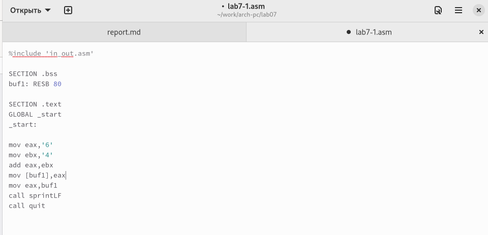{ #fig:002 width=70% }

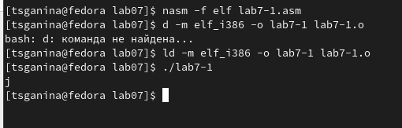{ #fig:003 width=70% }

2. Исправила листинг 1, заменив строки 

`mov eax,'6'` 

`mov ebx,'4'`

на строки 

`mov eax,6`

`mov ebx,4`

Создала исполняемый файл и запустила его, пользуясь таблицей ASCII
определила какому символу соответствует код 10, (рис. [-@fig:004], [-@fig:005], [-@fig:006]).

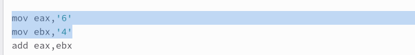{ #fig:004 width=70% }

{ #fig:005 width=70% }

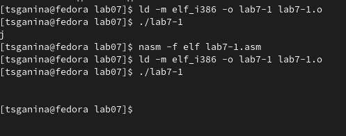{ #fig:006 width=70% }

Вывод: код 10 соответствует символу переноса строки, но на экране этот символ не отображается.

3. Создала файл lab7-2.аsm, ввела в него программу из листинга 2, создала исполняемый файл и запустила его (рис. [-@fig:007], [-@fig:008], [-@fig:009], [-@fig:010]).

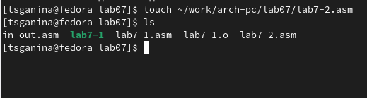{ #fig:007 width=70% }

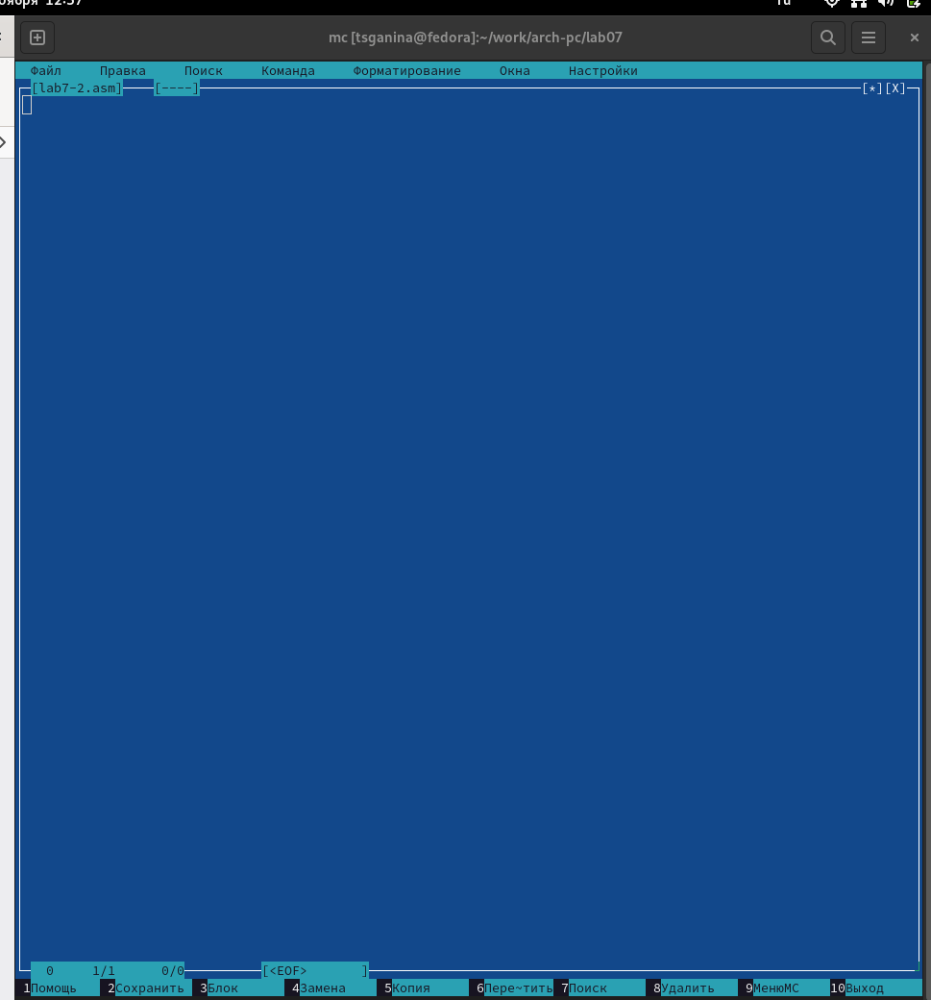{ #fig:008 width=70% }

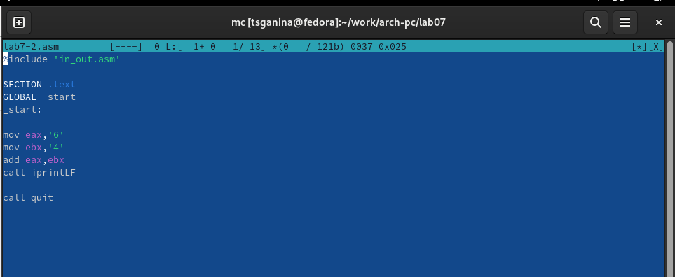{ #fig:009 width=70% }

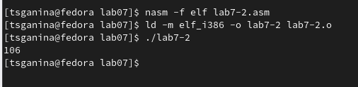{ #fig:010 width=70% }

4. Исправила листинг 2, заменив строки 

`mov eax,'6'` 

`mov ebx,'4'`

на строки 

`mov eax,6`

`mov ebx,4`

Создала исполняемый файл и запустила его (рис. [-@fig:011], [-@fig:012]).

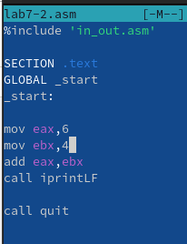{ #fig:011 width=70% }

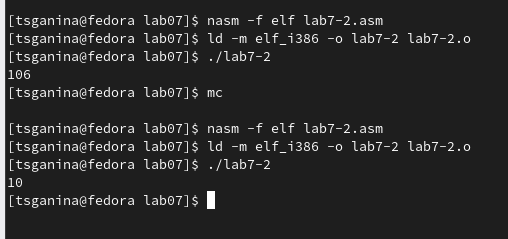{ #fig:012 width=70% }

5. Заменила функцию iprintLF на iprint. Создала исполняемый файл и запустила его. Выяснила чем отличается вывод функций iprintLF и iprint (рис. [-@fig:013]).

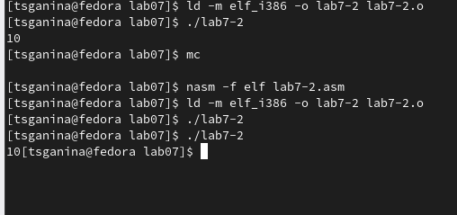{ #fig:013 width=70% }

Вывод: отличие состоит в том, что iprint не совершает перенос строки.

6. Создала файл lab7-3.asm, заполнила его соответственно с листингом 3, создала исполняемый файл и запустила его (рис. [-@fig:014], [-@fig:015], [-@fig:016]).

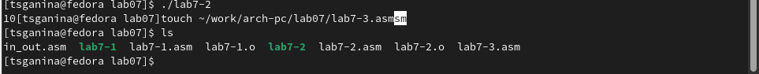{ #fig:014 width=70% }

{ #fig:015 width=70% }

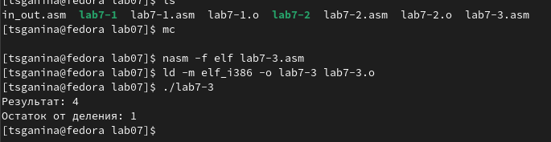{ #fig:016 width=70% }

7. Изменила файл так, чтобы программа вычисляла выражение $f(𝑥) = (4 ∗ 6 + 2)/5$ (рис. [-@fig:017], [-@fig:018]).

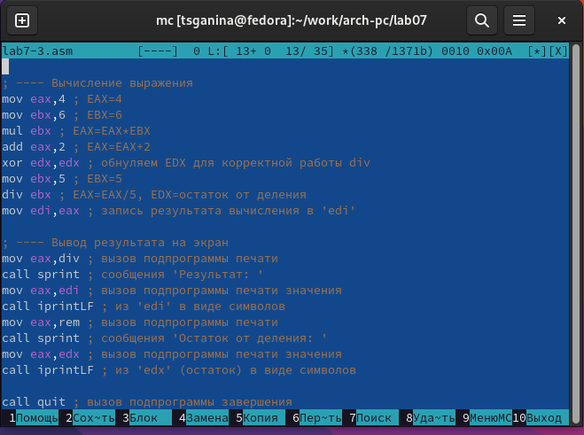{ #fig:017 width=70% }

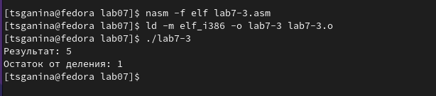{ #fig:018 width=70% }

8. Создала файл "вариант", заполнила его соответственно с листингом 4, создала исполняемый файл и запустила его (рис. [-@fig:019], [-@fig:020], [-@fig:021]).

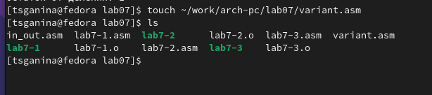{ #fig:019 width=70% }

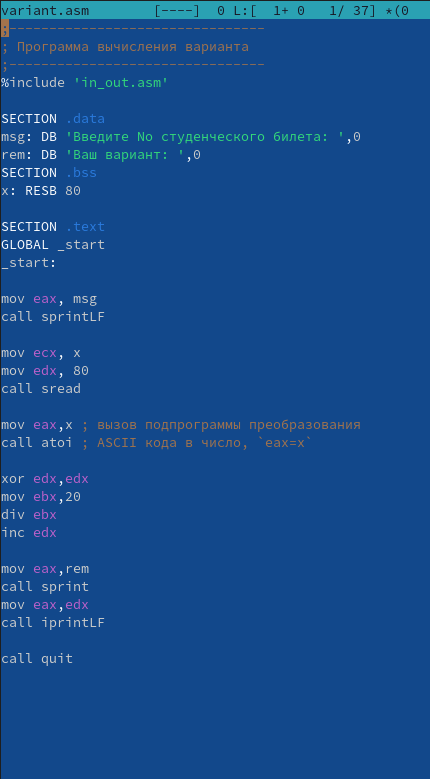{ #fig:020 width=70% }

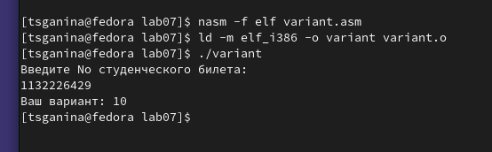{ #fig:021 width=70% }

Выполнив те же вычисления вручную, выяснила, что ответ, данный программой, верен.

9. Отвечаю на вопросы по разделу: 

    1. Какие строки листинга 7.4 отвечают за вывод на экран сообщения ‘Ваш
    вариант:’?
    
            `mov eax,rem`
            
            `call sprint`
    
    2. Для чего используется следующие инструкции?
    
            `mov ecx, x` - адрес вводимой строки `x` записывется в регистр `ecx`.
            
            `mov edx, 80` - 80 - длина вводимой строки, записана в `edx`.
            
            `call sread` - считывание ввода с клавиатуры.
    
            
    
    3. Для чего используется инструкция “call atoi”?
    
            Эта инструкция вызывает программу из файла "in_out.asm" и преобразует 
            ascii-код символа в целое число и записает результат в регистр eax.
    
    4. Какие строки листинга 7.4 отвечают за вычисления варианта?
    
        `xor edx,edx`
        
        `mov ebx,20`
        
        `div ebx`
        
        `inc edx`
    
    5. В какой регистр записывается остаток от деления при выполнении ин-
    струкции “div ebx”?
    
            В регистр `edx`
    
    6. Для чего используется инструкция “inc edx”?
    
            Для того, чтобы прибавить к значению `edx` единицу
    
    7. Какие строки листинга 7.4 отвечают за вывод на экран результата вычислений?
    
        `mov eax,edx`
        
        `call iprintLF`
    

10. Написать программу для вычисления выражения $5*(𝑥 + 18) − 28$ и проверить его при х=2 и при х=3 (рис. [-@fig:022], [-@fig:023]).

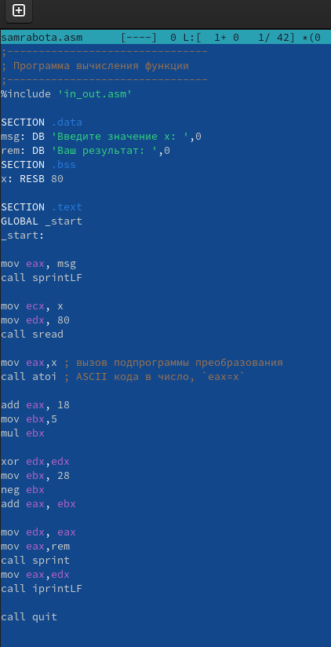{ #fig:022 width=70% }

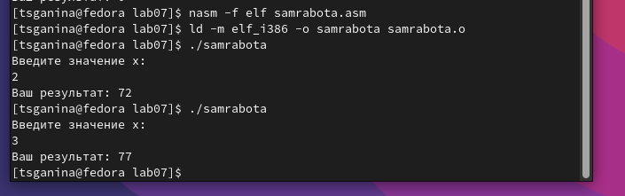{ #fig:023 width=70% }

Проверила себя, выполнив вычисления вручную - ответ получен верный.

# Листинги программ:

1. lab7-1.asm

        %include 'in_out.asm'

        SECTION .bss
        buf1: RESB 80

        SECTION .text
        GLOBAL _start
        _start:

        mov eax,6
        mov ebx,4
        add eax,ebx
        mov [buf1],eax
        mov eax,buf1
        call sprintLF

        call quit

2. lab7-2.asm

        %include 'in_out.asm'

        SECTION .text
        GLOBAL _start
        _start:

        mov eax,6
        mov ebx,4
        add eax,ebx
        call iprint

        call quit

3. lab7-3.asm

        ;--------------------------------
        ; Программа вычисления выражения
        ;--------------------------------
        %include 'in_out.asm' ; подключение внешнего файла

        SECTION .data
        div: DB 'Результат: ',0

        rem: DB 'Остаток от деления: ',0
        SECTION .text
        GLOBAL _start
        _start:

        ; ---- Вычисление выражения
        mov eax,4 ; EAX=4
        mov ebx,6 ; EBX=6
        mul ebx ; EAX=EAX*EBX
        add eax,2 ; EAX=EAX+2
        xor edx,edx ; обнуляем EDX для корректной работы div
        mov ebx,5 ; EBX=5
        div ebx ; EAX=EAX/5, EDX=остаток от деления
        mov edi,eax ; запись результата вычисления в 'edi'

        ; ---- Вывод результата на экран
        mov eax,div ; вызов подпрограммы печати
        call sprint ; сообщения 'Результат: '
        mov eax,edi ; вызов подпрограммы печати значения
        call iprintLF ; из 'edi' в виде символов
        mov eax,rem ; вызов подпрограммы печати
        call sprint ; сообщения 'Остаток от деления: '
        mov eax,edx ; вызов подпрограммы печати значения
        call iprintLF ; из 'edx' (остаток) в виде символов

        call quit ; вызов подпрограммы завершения

4. variant.asm

        ;--------------------------------
        ; Программа вычисления варианта
        ;--------------------------------
        %include 'in_out.asm'

        SECTION .data
        msg: DB 'Введите No студенческого билета: ',0
        rem: DB 'Ваш вариант: ',0
        SECTION .bss
        x: RESB 80

        SECTION .text
        GLOBAL _start
        _start:

        mov eax, msg
        call sprintLF

        mov ecx, x
        mov edx, 80
        call sread

        mov eax,x ; вызов подпрограммы преобразования
        call atoi ; ASCII кода в число, `eax=x`

        xor edx,edx
        mov ebx,20
        div ebx
        inc edx

        mov eax,rem
        call sprint
        mov eax,edx
        call iprintLF

        call quit

5. samrabota.asm - самостоятельная работа

        ;--------------------------------
        ; Программа вычисления функции
        ;--------------------------------
        %include 'in_out.asm'

        SECTION .data
        msg: DB 'Введите значение х: ',0
        rem: DB 'Ваш результат: ',0
        SECTION .bss
        x: RESB 80

        SECTION .text
        GLOBAL _start
        _start:

        mov eax, msg
        call sprintLF

        mov ecx, x
        mov edx, 80
        call sread

        mov eax,x ; вызов подпрограммы преобразования
        call atoi ; ASCII кода в число, `eax=x`

        add eax, 18
        mov ebx,5
        mul ebx

        xor edx,edx
        mov ebx, 28
        neg ebx
        add eax, ebx

        mov edx, eax
        mov eax,rem
        call sprint
        mov eax,edx
        call iprintLF

        call quit

# Выводы

В ходе этой лабораторной работы я освоила арифметические инструкции языка ассемблера NASM.

# Список литературы{.unnumbered}

1. [Текстовый документ "Лабораторная работа №7. Арифметические операции в NASM."](https://esystem.rudn.ru/pluginfile.php/1584637/mod_resource/content/1/%D0%9B%D0%B0%D0%B1%D0%BE%D1%80%D0%B0%D1%82%D0%BE%D1%80%D0%BD%D0%B0%D1%8F%20%D1%80%D0%B0%D0%B1%D0%BE%D1%82%D0%B0%20%E2%84%967.pdf)

::: {#refs}
:::
